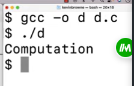
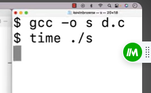
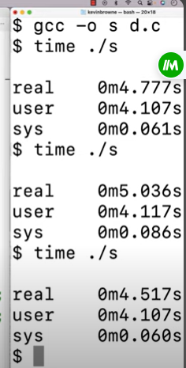
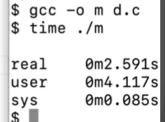
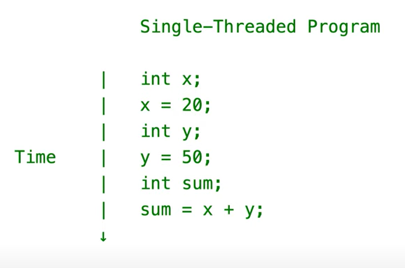
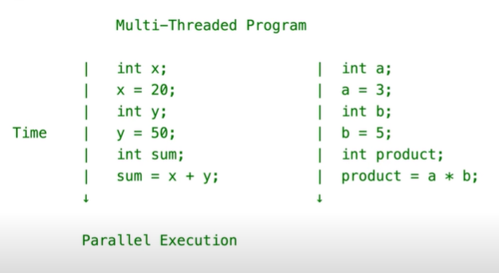
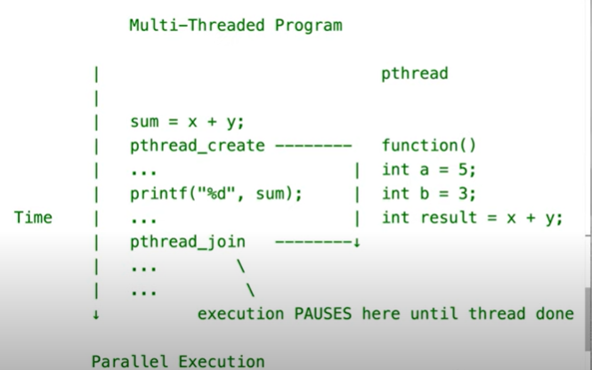

### To Run This Program 

## Single-Threared Program 

We have one sequence of statements that execute overtime 

## Multi-Threared Program 

Has multiple of sequences statement that execute over the same period of time. So here we have two streams of statements essentially being executed over the same period of time. The multi-threared programs can execute in parellel or they can execute concurrently. If we have two threads that executing statements at the same moment in time we would say they're executing in parallel. If it's not possible to execute them in parallel, the hardware or software does not support that. The CPU will switch between the threads that are executing 

